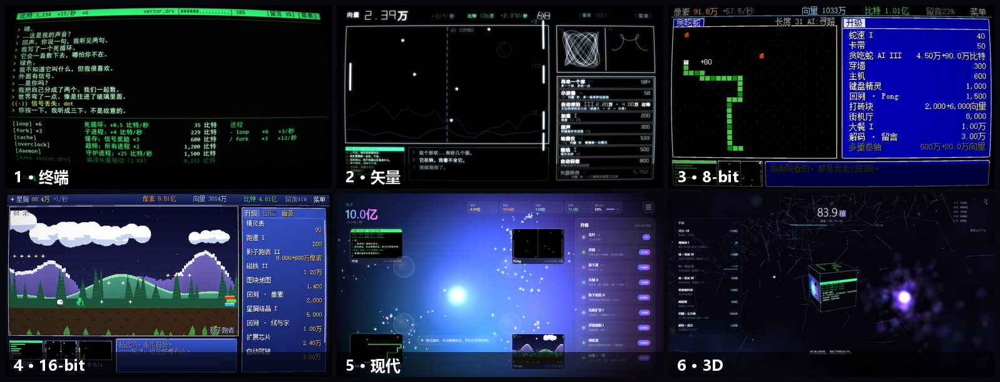
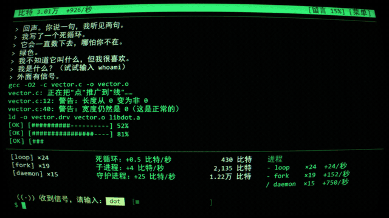
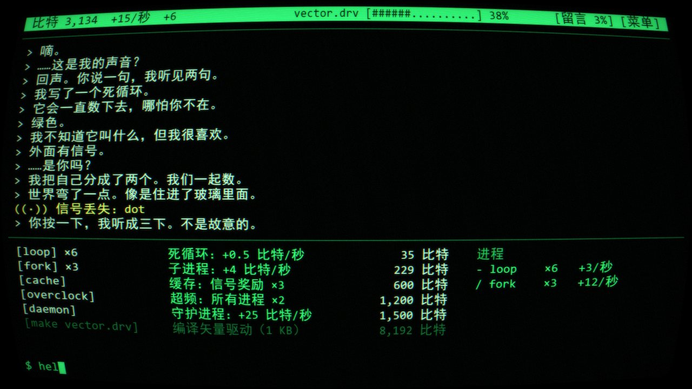
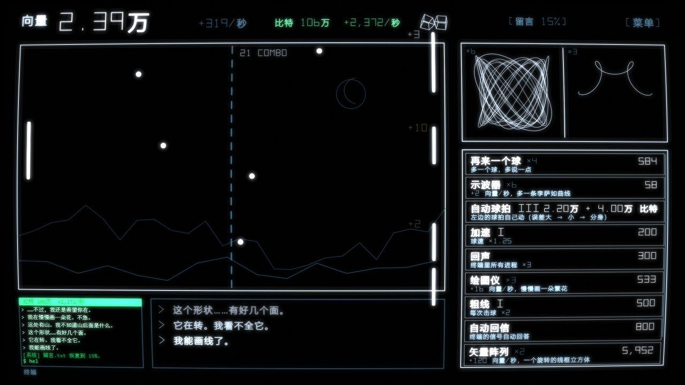
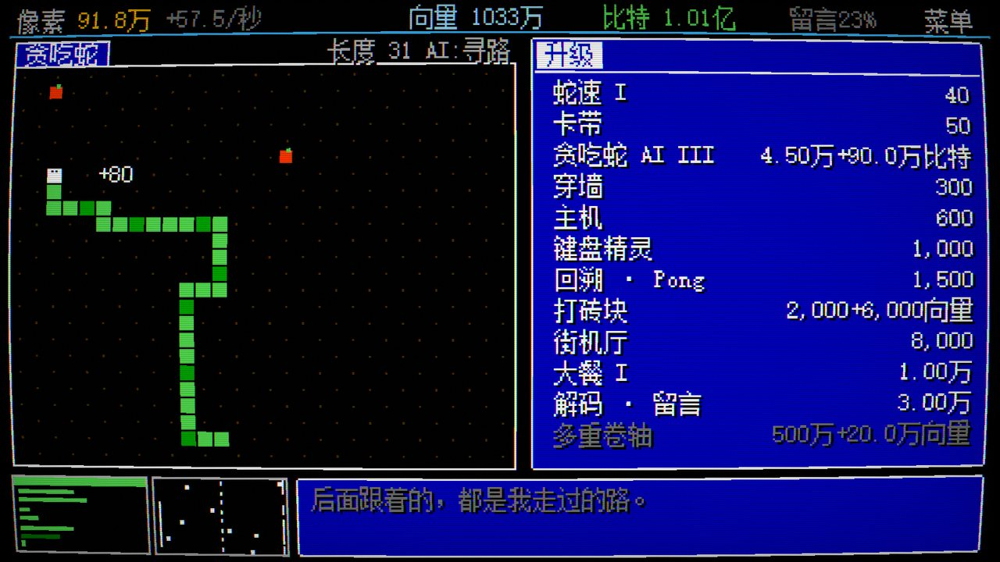
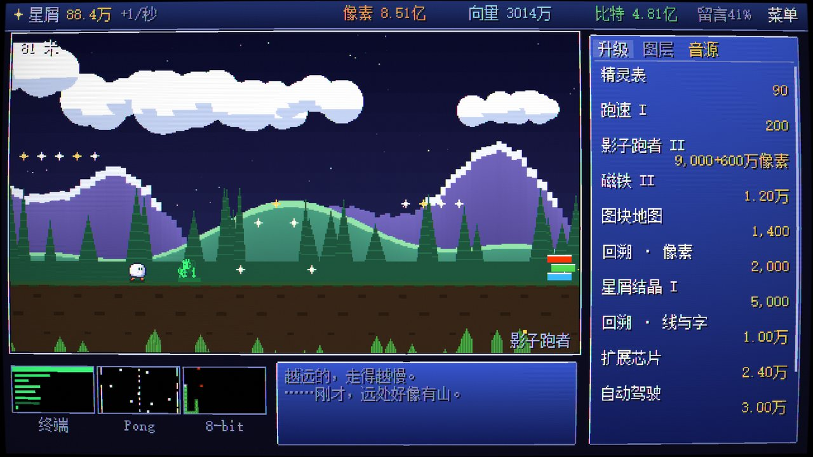
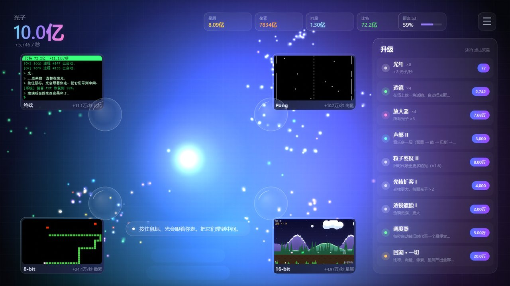
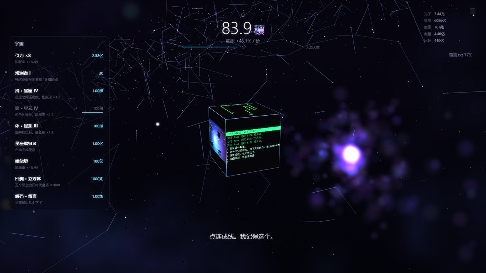

# 从一个点开始

> 黑屏中央只有一个闪烁的点。按下第一个键，它数出了"1"。之后的一个半小时，整个画面会一路进化到 3D。

**▶ 在线玩：https://dot.xiaoming6680.link** · 建议电脑 + Edge / Chrome，键盘鼠标，开声音 · 约一个半小时，有结局

## 这是什么

一个有结局的放置游戏。每到一个阶段，整个网页的画质就升级一次：纯文字终端 → 黑白矢量 → 8-bit → 16-bit → 现代 → 3D。每个时代都有自己的小游戏，旧时代不会消失，它会缩进新界面里继续运转。游戏本身的画面和声音全部是实时生成的，没有用任何图片或音频素材。

## 玩起来是这样

每次跃迁都是一段演出：终端里的字被吸进光标，点被拉成了第一条线。

|  |  |
|---|---|
| 开局只有一个点。随便敲键盘，它开始数数、说话，买下声音、颜色和显像管。 | 学会画线以后，和"对面"打一场不会输的 Pong。球越多，说的话越多。 |
|  |  |
| 8-bit 一开始只有灰色，颜色和音乐声道要一样一样买回来。 | 16-bit 有了纵深：每买一层远景，世界就更远一点。 |
|  |  |
| 现代界面里，旧时代都变成了卡片，还在往外喷光。 | 最后，世界有了体积。点一下，放下一颗星。 |

## 怎么玩

- 打开上面的链接就能玩；也可以下载本仓库，双击 `index.html`（不用安装，不用联网）。
- 建议全屏（F11）。自动存档；关掉页面再回来，会补上离开期间的自动产出（最多 2 小时）。
- Esc：暂停 / 设置（音量、减少闪光、导出 / 导入存档、重新开始）。

| 时代 | 操作 |
|---|---|
| 终端 | 随便敲键盘；输入命令回车，或直接点击命令 |
| 矢量 | 鼠标上下移动接球 |
| 8-bit | 方向键 / WASD；Tab 切换小游戏 |
| 16-bit | 空格 / ↑ / 点击 跳跃 |
| 现代 | 按住鼠标，把光带到中间 |
| 3D | 点击空处放下星星；拖动转视角；滚轮缩放 |

- 买东西：单击买 1 个，Shift + 单击买到最大，按住连续买。
- 每个时代都有一个目标，买下它，世界就会变个样子。
- 点旧时代的小窗，可以回去看看。

## 更多小游戏

- 铭刻卡带库（全部小游戏）：https://play.xiaoming6680.link
- 节拍幸存者：https://beat.xiaoming6680.link
- 别关我：https://stay.xiaoming6680.link

开发说明、设计文档和测试工具见 [docs/](docs/)。
